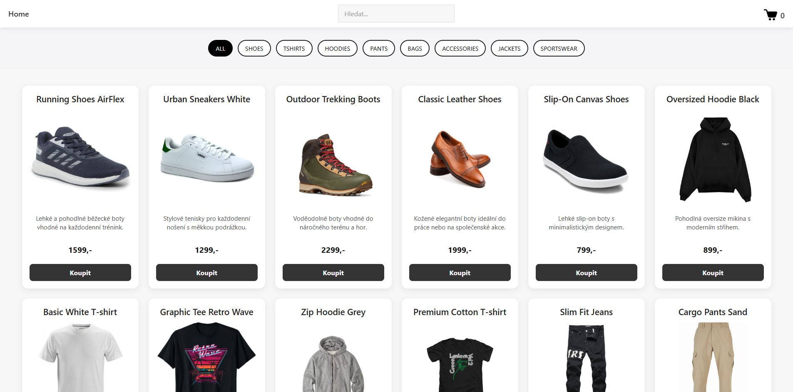
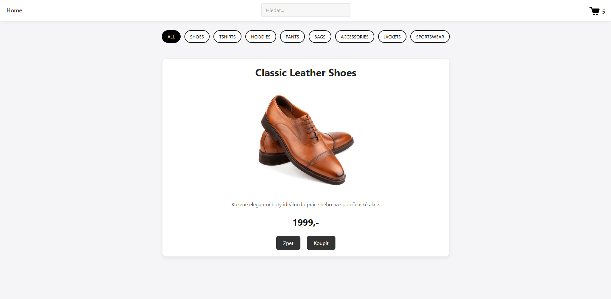
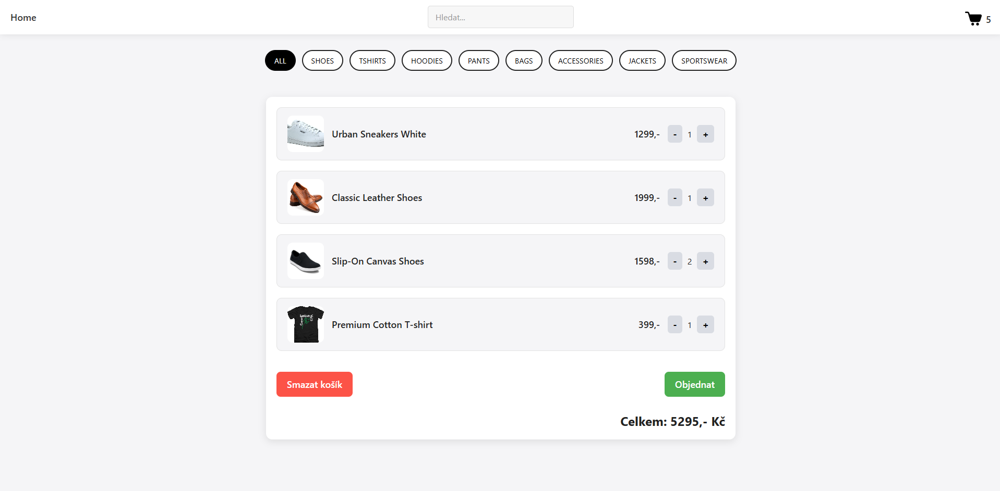
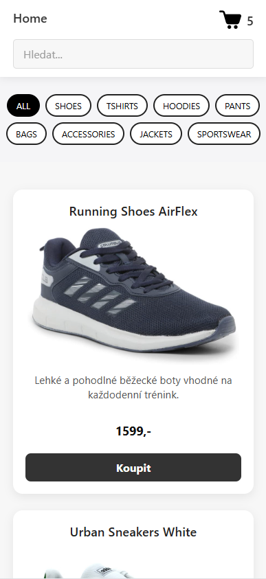

# Mini Shop (React)

Mini Shop is a simple e-commerce web application built with React.  
The project focuses on core frontend concepts such as state management, component composition, routing, and basic user interactions typical for real-world applications.

This project was created as a learning and portfolio project to demonstrate practical React knowledge.

---

## Features

### DONE

- Product listing with pagination ("Load more" functionality)
- Product detail page
- Shopping cart functionality
- Add/remove products from cart
- Increase/decrease product quantity
- Cart total price calculation
- Cart persistence using Local Storage
- Search products by name and description
- Category-based product filtering
- Responsive layout
- Client-side routing with React Router

### TODO / Possible Extensions

- User authentication
- Checkout form validation
- Order summary page
- Backend API integration
- Sorting products (price, name)
- UI animations and transitions

---

## Tech Stack

- JavaScript (ES6+)
- React
- React Router
- HTML5
- CSS3 (Flexbox)
- Local Storage
- Vite

---

## What This Project Demonstrates

- Working with React functional components
- State management using `useState` and `useEffect`
- Lifting state up and passing props between components
- Conditional rendering
- List rendering and array methods (`map`, `filter`, `reduce`)
- Client-side routing
- Persisting application state with Local Storage
- Basic UX patterns used in e-commerce applications

---

## Screenshots

### Home page



### Product detail



### Cart



### Mobile view



---

## How to Run Locally

```bash
git clone https://github.com/your-username/mini-shop.git
cd mini-shop
npm install
npm run dev
```

